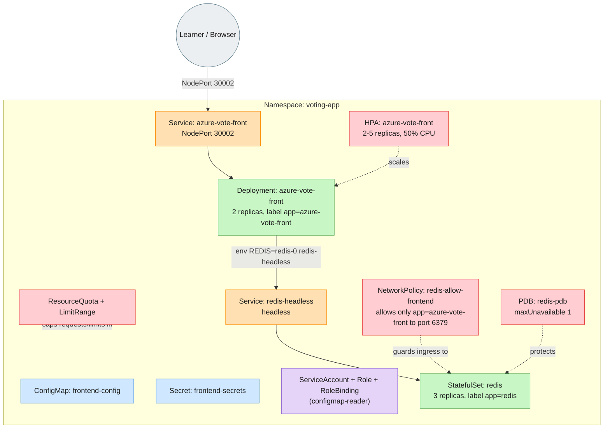

# Advanced Lab: Harden the Voting App

Builds on the same Azure Voting App, but with Redis as a StatefulSet and a set of
operational guardrails (NetworkPolicy, HPA, PodDisruptionBudget, ResourceQuota) layered
on top.

## Objective

You've been handed a `voting-app` namespace that's
meant to run as a resilient service - Redis with persistent storage,
locked-down network access, autoscaling, and a disruption budget. It's
deployed, but broken: Fix all the bugs hiding across the manifests.

**Your task:** fix the namespace so that, by the end of Part 1, every one of
these is true - verify each with the command shown:

1. Every Pod is healthy:
   `kubectl get pods -n voting-app` shows `redis-0`, `redis-1`, `redis-2`, and
   both `azure-vote-front` Pods `Running`/`1/1`.
2. The app actually works end-to-end:
   casting a vote in the browser (or via `curl`) changes the tally - proving
   the frontend really reached Redis, not just that the Pods are up.
3. Redis storage is real, not ephemeral:
   `kubectl get pvc -n voting-app` shows every PVC `Bound`.
4. Only the frontend can talk to Redis:
   a Pod labeled `app=azure-vote-front` can `PING` Redis on 6379; a Pod with
   any other label times out.
5. The HPA has real metrics:
   `kubectl describe hpa azure-vote-front -n voting-app` shows a CPU
   percentage, not `<unknown>`.
6. The PDB actually caps disruption:
   `kubectl get pdb redis-pdb -n voting-app` shows `ALLOWED DISRUPTIONS: 1`,
   not `0`.
7. Capacity fits the quota:
   every Pod's `requests`/`limits` add up to within the namespace's
   `ResourceQuota` - without being shrunk below what the Pods genuinely need
   to run.

**Part 2** builds on this working baseline once all 7 are green: grant a
second ServiceAccount cluster-wide read access to Pods, trigger the HPA with
real load and watch it scale back down, safely drain Redis's node without
losing data, and prove the NetworkPolicy discriminates by label rather than
just existing.

The 6 bugs don't map one-to-one onto the 7 checks in a tidy order - fixing one
often exposes the next. Work through them in whatever order `kubectl
describe`/`logs` reveals, not necessarily top-to-bottom.

**Prerequisite:** a metrics-server. The HPA bug/exercise is unverifiable without
it - the HPA shows `<unknown>` forever regardless of whether you've fixed anything.
Install it before deploying:
```bash
kubectl apply -f https://github.com/kubernetes-sigs/metrics-server/releases/latest/download/components.yaml
kubectl patch deployment metrics-server -n kube-system --type=json \
  -p='[{"op":"add","path":"/spec/template/spec/containers/0/args/-","value":"--kubelet-insecure-tls"}]'
kubectl wait --for=condition=available deployment/metrics-server -n kube-system --timeout=120s
```

**Note:** The `--kubelet-insecure-tls` flag is required on KIND (and most local clusters)
because kubelet's serving certificate isn't signed for a hostname metrics-server
trusts by default. Confirm it's actually working with `kubectl top nodes` before
moving on.

## Architecture (once fixed)



## Part 1: Bug Fixes

`manifests/` has 14 files, numbered in apply order. 6 bugs are planted across the new
resource kinds this tier introduces (StatefulSet, headless Service, NetworkPolicy, HPA,
PodDisruptionBudget, ResourceQuota/LimitRange) - the namespace/ConfigMap/Secret/RBAC
layer is given working this time, since that was the previous tier's lesson.

```bash
kubectl apply -f manifests/
kubectl get all -n voting-app
kubectl get pvc,networkpolicy,hpa,pdb,resourcequota -n voting-app
```

Your job: find and fix all 6 bugs, then redeploy, until:
- `kubectl get pods -n voting-app` shows all `redis-0/1/2` and both
  `azure-vote-front` Pods `Running`/`1/1`
- `kubectl get pvc -n voting-app` shows every PVC `Bound`
- `kubectl describe hpa azure-vote-front -n voting-app` shows a real percentage,
  not `<unknown>`
- `kubectl get pdb redis-pdb -n voting-app` shows `ALLOWED DISRUPTIONS: 1`
- The frontend can actually reach Redis (vote buttons work). The Service is
  `NodePort 30002`, but that port isn't reachable from your host on either
  killercoda or local KIND - use `kubectl port-forward -n voting-app
  svc/azure-vote-front 8080:80` and `curl http://localhost:8080` instead. A
  NetworkPolicy is still in effect that denies traffic from anything *other*
  than the frontend
- Total requests/limits across all Pods fit under the ResourceQuota without having to
  gut the resource values below what they genuinely need

Diagnostic commands by bug category:
- `kubectl describe pvc -n voting-app` - storage/provisioner errors
- `kubectl get svc redis-headless -n voting-app -o yaml` - is `clusterIP` really `None`?
- `kubectl describe networkpolicy -n voting-app` - does `podSelector`/`ingress.from`
  actually match the Pod labels you're expecting?
- `kubectl describe hpa -n voting-app` - `<unknown>` targets almost always mean a
  missing resource request somewhere upstream
- `kubectl get pdb -n voting-app` - does `ALLOWED DISRUPTIONS` actually cap anything?
- `kubectl describe resourcequota -n voting-app` and `kubectl get events -n
  voting-app --field-selector reason=FailedCreate` - quota math

Note on `REDIS`: it points at `redis-0.redis-headless...` (one specific replica), not
the bare `redis-headless` Service name. The 3 Redis Pods are independent, unreplicated
stores - a headless Service's DNS returns all 3 Pod IPs, and different app workers
resolving it would land on different, out-of-sync backends. Targeting one specific Pod
by its stable per-Pod DNS name is exactly what StatefulSet + headless Service is for.

## Part 2: Extending the Deployment

1. **RBAC escalation**: the `Role`/`RoleBinding` here only grant ConfigMap access inside
   this namespace. Create a `ClusterRole` + `ClusterRoleBinding` for a new
   `monitoring-sa` ServiceAccount that can `list` Pods in **every** namespace, and
   nothing else. Verify across at least two different namespaces with
   `kubectl auth can-i list pods -n <ns> --as=system:serviceaccount:voting-app:monitoring-sa`.

2. **HPA**: generate CPU load against the frontend and watch the HPA scale out, then
   back down once load stops. The namespace has a ResourceQuota tracking `requests.cpu`/
   `requests.memory`, so any ad-hoc Pod you create here must declare resource requests or
   it will be rejected outright. `kubectl run`'s `--requests`/`--limits` flags have been
   removed on current `kubectl` - use `--overrides` instead, which puts the resources
   (and the command) inside a JSON Pod-spec fragment:
   ```bash
   kubectl run load-gen --rm -it --image=busybox --restart=Never -n voting-app \
     --overrides='{"apiVersion":"v1","spec":{"containers":[{"name":"load-gen","image":"busybox","command":["/bin/sh","-c","while true; do wget -q -O- http://azure-vote-front > /dev/null; done"],"resources":{"requests":{"cpu":"10m","memory":"16Mi"},"limits":{"cpu":"50m","memory":"32Mi"}}}]}}'
   # in another terminal:
   kubectl get hpa azure-vote-front -n voting-app -w
   ```
   Stop the load with `kubectl delete pod load-gen -n voting-app` once you've seen it
   scale up; the HPA scales back down on its own after a short stabilization window.

3. **PDB**: simulate a voluntary disruption and verify the PDB actually caps it:
   ```bash
   kubectl get pod -n voting-app -l app=redis -o wide   # note which node(s) hold Redis Pods
   kubectl drain <node> --ignore-daemonsets --delete-emptydir-data --pod-selector='app=redis'
   ```
   Expected: the drain respects the PDB and evicts at most 1 Redis Pod at a time,
   pausing until it's `Ready` again before evicting the next.

   On KIND (and most local clusters), the default `rancher.io/local-path`
   StorageClass pins each PVC to whichever node first provisioned it - a Pod using
   that PVC can only ever schedule back onto that exact node, no matter how many
   other workers exist. So draining a node that holds a Redis Pod stalls after the
   first eviction: the replacement Pod needs its PVC's node back, but that node is
   cordoned. This isn't a worker-count problem - it happens the same way whether
   the cluster has one worker or five, any time the drained node is one that
   actually holds Redis data. Uncordon the node *while the drain is still running*
   (from a second terminal) so the replacement can land and the drain can proceed
   to the next Pod: `kubectl uncordon <node>`.

4. **NetworkPolicy verification**: confirm the policy is scoped correctly, not just
   present - a Pod with the *right* label can reach Redis, a Pod with the wrong one can't.
   Same `--overrides` note as task 2 applies:
   ```bash
   kubectl run allowed --rm -it --image=redis:7-alpine --restart=Never -n voting-app \
     --labels="app=azure-vote-front" \
     --overrides='{"apiVersion":"v1","spec":{"containers":[{"name":"allowed","image":"redis:7-alpine","command":["redis-cli","-h","redis-headless","-p","6379","-t","5","ping"],"resources":{"requests":{"cpu":"10m","memory":"16Mi"},"limits":{"cpu":"50m","memory":"32Mi"}}}]}}'
   kubectl run denied --rm -it --image=redis:7-alpine --restart=Never -n voting-app \
     --labels="app=debug" \
     --overrides='{"apiVersion":"v1","spec":{"containers":[{"name":"denied","image":"redis:7-alpine","command":["redis-cli","-h","redis-headless","-p","6379","-t","5","ping"],"resources":{"requests":{"cpu":"10m","memory":"16Mi"},"limits":{"cpu":"50m","memory":"32Mi"}}}]}}'
   ```
   Expected: the first returns `PONG`, the second times out.
