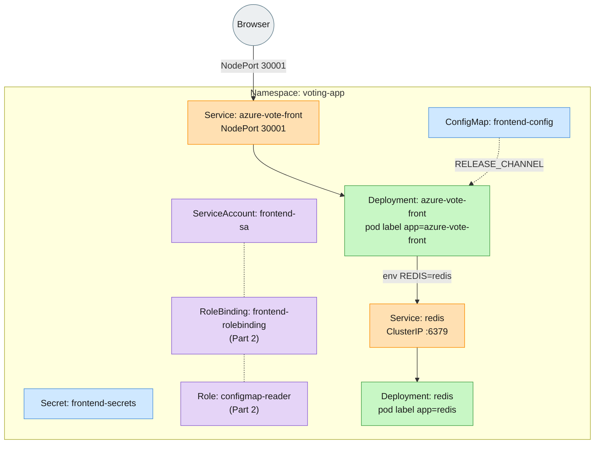

# Intermediate Lab: Fix the Voting App, Then Grow It

Runs on killercoda.com's Kubernetes Playground or a local [KIND cluster](../../kind/) - no custom
image builds, only public images (`neilpeterson/azure-vote-front`, `redis`) used.

## Objective

Get the Azure Voting App actually working - not just "`kubectl apply` exits
0," but a vote cast through the browser (or `curl`) that updates the tally
for real. Each planted bug blocks that in a different way (missing config,
wrong port, mismatched labels...) - fixing them one at a time, watching the
failure change shape as you go, is the point.

Once it works, Part 2 proves you can operate it like a real service: lock
down who's allowed to read its config, ship an update without losing the app
(and undo it if it goes wrong), and scale it under more traffic.

## Architecture



## Part 1: Bug Fixes

`manifests/` has 8 files, numbered in apply order. They deploy, but the app doesn't
actually work - **5 bugs are planted across them.** Deploy as-is first and observe
what breaks before changing anything:

```bash
kubectl apply -f manifests/
kubectl get pods -n voting-app
kubectl get all -n voting-app
```

Your job: find and fix all 5 bugs, then redeploy, until:
- `kubectl get pods -n voting-app` shows both `azure-vote-front` and `redis`
  Pods `Running`/`1/1`
- `kubectl get endpoints -n voting-app` shows every Service with at least one
  endpoint
- The app is reachable and functional. The Service is `NodePort 30001`, but that
  port isn't reachable from your host on either killercoda or local KIND - use
  `kubectl port-forward -n voting-app svc/azure-vote-front 8080:80` and
  `curl http://localhost:8080` instead. Clicking a vote button actually changes
  the tally (proving the frontend can really talk to Redis, not just that the
  Pod is `Running`)

Useful diagnostic commands:
- `kubectl get pods -n voting-app` - is the Pod even created?
- `kubectl get deployment azure-vote-front -n voting-app` - if this says
  `NotFound`, re-run `kubectl apply -f manifests/` and read its error output
  directly.
- `kubectl describe pod <pod> -n voting-app` - events, container state reasons
  (`CreateContainerConfigError`, etc.)
- `kubectl logs <pod> -n voting-app` - application-level errors
- `kubectl get endpoints -n voting-app` - does a Service actually have
  endpoints, and on which port?

## Part 2: Extending the Deployment

Once the app works end-to-end, go further:

1. **RBAC**: `03-serviceaccount.yaml` creates `frontend-sa`, but nothing grants it
   any permissions. Write a `Role` named `configmap-reader` that allows
   `get`/`list`/`watch` on `ConfigMaps` only, nothing else, in the `voting-app`
   namespace, then a `RoleBinding` that binds it to `frontend-sa`. Prove both
   the grant and the restriction:
   ```bash
   kubectl auth can-i get configmaps -n voting-app --as=system:serviceaccount:voting-app:frontend-sa
   kubectl auth can-i get secrets -n voting-app --as=system:serviceaccount:voting-app:frontend-sa
   ```
   The first should say `yes`, the second `no`.

2. **Rollout**: change the frontend's image tag from `v1` to `v2`
   (`neilpeterson/azure-vote-front:v2`). Watch it roll out, confirm the visual change in the
   browser, then roll it back:

3. **Scaling**: scale the frontend to 3 replicas and prove the Service actually
   load-balances across all three (not just that 3 Pods exist).
